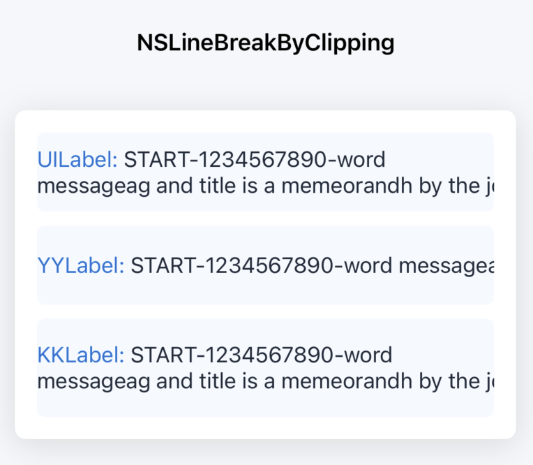
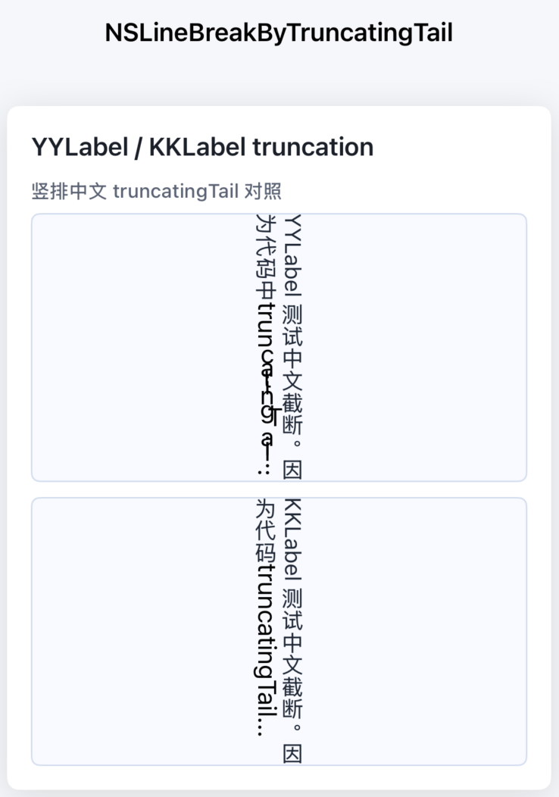
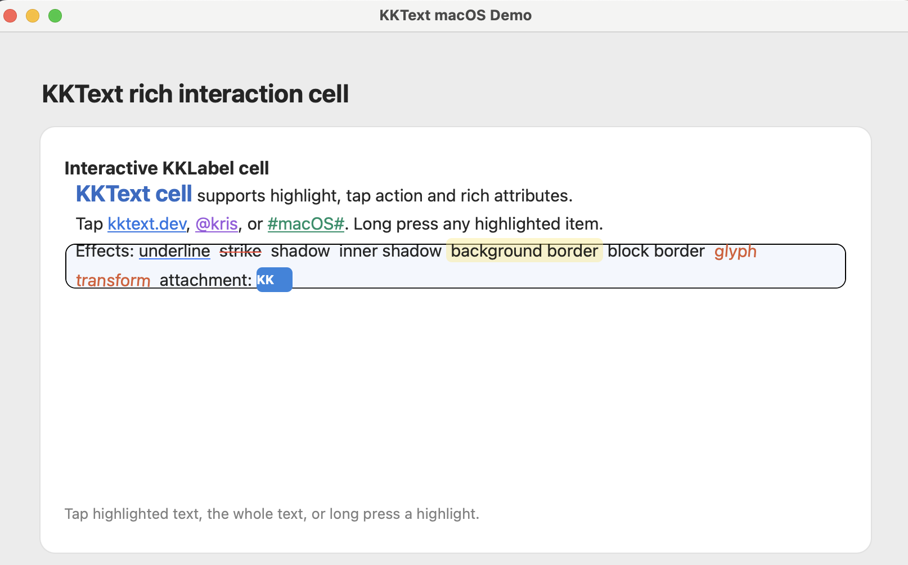
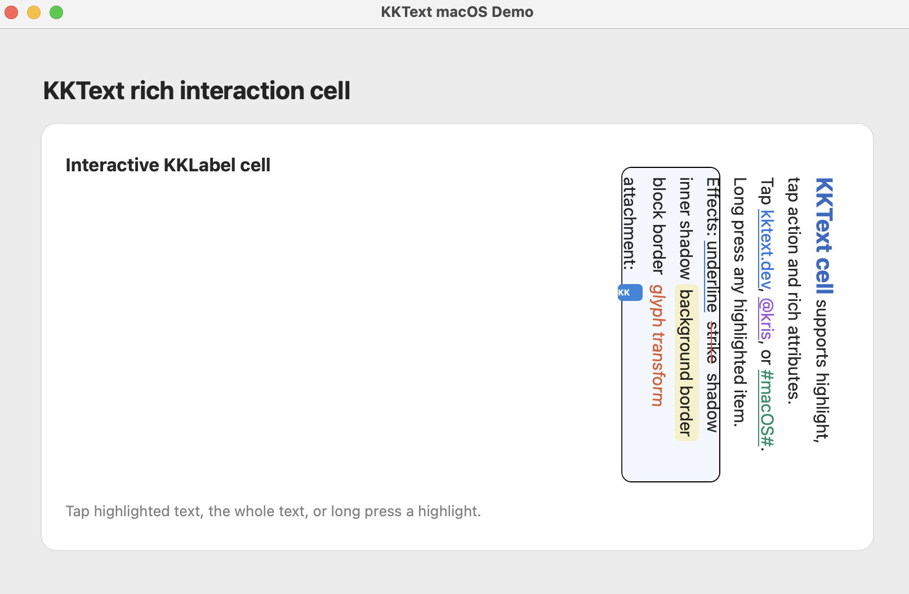

# KKText

KKText is a rich text framework for iOS and macOS, based on YYText.

The project keeps YYText's Core Text based layout and rendering model, and renames the public `YY` API prefix to `KK`. On top of the original project, KKText focuses on modern SDK compatibility, iOS/macOS platform adaptation, and rendering behavior improvements.

This is not an official YYText release. YYText was originally created by ibireme, and KKText keeps the original MIT license notice in the source files.

## Improvements

### UILabel-Compatible Clipping

KKText aligns clipping behavior with `UILabel` when `NSLineBreakByClipping` is used.

```objc
NSMutableAttributedString *uiText = [self textWithPrefix:@"UILabel: "];
NSMutableAttributedString *yyText = [self textWithPrefix:@"YYLabel: "];
NSMutableAttributedString *kkText = [self textWithPrefix:@"KKLabel: "];

self.uiContentLabel.attributedText = uiText;
self.uiContentLabel.numberOfLines = 2;
self.uiContentLabel.lineBreakMode = NSLineBreakByClipping;

self.yyContentLabel.attributedText = yyText;
self.yyContentLabel.numberOfLines = 2;
self.yyContentLabel.lineBreakMode = NSLineBreakByClipping;

self.kkContentLabel.attributedText = kkText;
self.kkContentLabel.numberOfLines = 2;
self.kkContentLabel.lineBreakMode = NSLineBreakByClipping;
```



### Vertical Truncation Fix

KKText fixes vertical truncating rendering for text and custom truncation tokens. The demo compares the original `YYLabel` with `KKLabel` by using the same vertical-form setup.

```objc
NSString *yyString = @"YYLabel 测试中文截断。因为代码中计算 indices 的方法不能用于 truncated line，被截断的那一行文字可能无法正确的展示，包括是否旋转字符（比如中文在竖排情况下不需要旋转）。";
NSString *kkString = @"KKLabel 测试中文截断。因为代码中计算 indices 的方法不能用于 truncated line，被截断的那一行文字可能无法正确的展示。包括是否旋转字符（比如中文在竖排情况下不需要旋转）。";
    
NSMutableAttributedString *yyText = [[NSMutableAttributedString alloc] initWithString:yyString];
yyText.yy_font = [UIFont systemFontOfSize:15.0];
yyText.yy_color = [UIColor colorWithRed:0.12 green:0.16 blue:0.22 alpha:1.0];
    
NSMutableAttributedString *kkText = [[NSMutableAttributedString alloc] initWithString:kkString];
kkText.kk_font = [UIFont systemFontOfSize:15.0];
kkText.kk_color = [UIColor colorWithRed:0.12 green:0.16 blue:0.22 alpha:1.0];
    
NSString *tokenString = @"truncatingTail...";
NSMutableAttributedString *yyToken = [[NSMutableAttributedString alloc] initWithString:tokenString];
NSMutableAttributedString *kkToken = [[NSMutableAttributedString alloc] initWithString:tokenString];
yyToken.yy_font = [UIFont systemFontOfSize:17.0];
kkToken.kk_font = [UIFont systemFontOfSize:17.0];
    
self.yyLabel.verticalForm = YES;
self.yyLabel.numberOfLines = 2;
self.yyLabel.textAlignment = NSTextAlignmentCenter;
self.yyLabel.attributedText = yyText;
self.yyLabel.truncationToken = yyToken;
self.yyLabel.lineBreakMode = NSLineBreakByTruncatingTail;
    
self.kkLabel.verticalForm = YES;
self.kkLabel.numberOfLines = 2;
self.kkLabel.textAlignment = NSTextAlignmentCenter;
self.kkLabel.attributedText = kkText;
self.kkLabel.truncationToken = kkToken;
self.kkLabel.lineBreakMode = NSLineBreakByTruncatingTail;
```

### Vertical Truncation Line Rendering

The comparison below shows the vertical truncation line rendering difference between the original `YYLabel` and `KKLabel`.



## Features

- Asynchronous text layout and rendering.
- Rich attributed text support with highlights, borders, shadows, attachments, and custom glyph transforms.
- Interactive text ranges with tap and long-press actions.
- Core Text based layout query APIs, such as text bounding rects, selection rects, and caret positions.
- Vertical text layout support for CJK text.
- iOS and macOS support through platform compatibility macros.

## Platform

| Platform | Minimum Version | Notes |
| --- | --- | --- |
| iOS | 13.0 | Supports `KKLabel` and `KKTextView`. |
| macOS | 14.0 | Currently focuses on `KKLabel` display and interaction support. |

## Installation

### CocoaPods

After KKText is published to CocoaPods trunk, add it to your `Podfile`:

```ruby
target 'YourApp' do
  pod 'KKText', '~> 0.1.0'
end
```

For an iOS app:

```ruby
platform :ios, '13.0'

target 'YouriOSApp' do
  pod 'KKText', '~> 0.1.0'
end
```

For a macOS app:

```ruby
platform :osx, '14.0'

target 'YourMacApp' do
  pod 'KKText', '~> 0.1.0'
end
```

Then run:

```bash
pod install
```

### Install From Git

If the version has not been published to CocoaPods trunk yet, you can depend on the Git repository directly:

```ruby
pod 'KKText', :git => 'https://github.com/kriskicekk/KKText.git', :tag => '0.1.0'
```

For local development:

```ruby
pod 'KKText', :path => '../KKText'
```

## Import

```objc
#import <KKText/KKText.h>
```

## Quick Start

Create a `KKLabel` and assign attributed text:

```objc
KKLabel *label = [[KKLabel alloc] initWithFrame:CGRectMake(20, 80, 320, 160)];
label.numberOfLines = 0;
label.textVerticalAlignment = KKTextVerticalAlignmentTop;

NSMutableAttributedString *text = [[NSMutableAttributedString alloc] initWithString:@"Hello KKText"];
text.kk_font = [UIFont systemFontOfSize:16];
text.kk_color = [UIColor blackColor];

label.attributedText = text;
[self.view addSubview:label];
```

On macOS, `UIView`, `UIColor`, `UIFont`, and related UIKit-style names are mapped to AppKit types by `KKTextPlatform.h`, so the same basic API style can be used in shared source.

## Highlight Action

Use `KKTextHighlight` to make a text range interactive:

```objc
NSMutableAttributedString *text = [[NSMutableAttributedString alloc] initWithString:@"Tap KKText to handle an action."];
text.kk_font = [UIFont systemFontOfSize:16];
text.kk_color = [UIColor blackColor];

NSRange range = [text.string rangeOfString:@"KKText"];
if (range.location != NSNotFound) {
    UIColor *tintColor = [UIColor colorWithRed:0.0 green:0.36 blue:0.8 alpha:1.0];
    KKTextHighlight *highlight = [KKTextHighlight highlightWithBackgroundColor:[tintColor colorWithAlphaComponent:0.16]];
    [highlight setColor:tintColor];
    highlight.tapAction = ^(UIView *containerView, NSAttributedString *string, NSRange tappedRange, CGRect rect) {
        NSLog(@"Tapped: %@", [string.string substringWithRange:tappedRange]);
    };
    [text kk_setTextHighlight:highlight range:range];
}

label.attributedText = text;
```

## Notes For macOS

KKText uses `KKTextPlatform.h` to map common UIKit names to AppKit types on macOS. This keeps most attributed string and label drawing APIs close to the iOS version.

### KKLabel macOS Demo

Horizontal layout demo:



Vertical layout demo:



Some editing-related UIKit features, such as keyboard management, pasteboard handling, magnifier behavior, and selection UI, are platform-specific. They are kept on iOS unless a macOS implementation is added.

## License

KKText is released under the MIT license. See `LICENSE` for details.

This project is based on YYText. The original YYText source files were created by ibireme and are also distributed under the MIT-style license.
